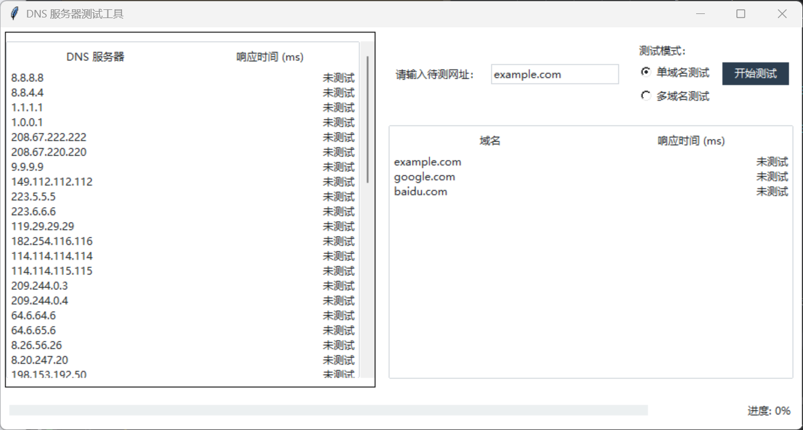

## DNS 测试工具

### 概述
DNS 测试工具是一款基于 Python 和 ttkbootstrap 库的图形化应用程序，用于测试 DNS 服务器的性能。通过测量 DNS 服务器对指定域名的响应时间，用户可以快速了解不同 DNS 服务器的性能表现。工具支持单域名和多域名测试模式，并提供实时进度更新和结果展示。

### 功能特点
1. DNS 服务器测试：支持对多个 DNS 服务器进行响应时间测试。
2. 单域名/多域名模式：用户可以选择测试单个域名或从文件中加载多个域名进行批量测试。
3. 实时进度更新：通过进度条和状态标签实时显示测试进度。
4. 结果可视化：测试结果以表格形式展示，响应时间用颜色标记（绿色：快速，黄色：中等，橙色：较慢，红色：超时或错误）。
5. 多线程支持：使用多线程并发测试，提高测试效率。
6. 文件支持：从文件加载 DNS 服务器列表和域名列表（dns_servers.txt 和 domains.txt）。

### 安装依赖
在运行 DNS 测试工具之前，请确保已安装以下依赖库：

1. Python 3.8+：建议使用 Python 3.8 或更高版本。
2. ttkbootstrap：现代化的 ttk 替代库，提供美观的界面样式。
3. dnspython：用于与 DNS 服务器交互的库。

安装依赖库：
```bash
pip install ttkbootstrap dnspython
```

### 文件说明
1. dns_servers.txt：包含需要测试的 DNS 服务器列表，每行一个服务器地址。例如：
   ```
   8.8.8.8
   1.1.1.1
   208.67.222.222
   ```

2. domains.txt：包含需要测试的域名列表，每行一个域名。例如：
   ```
   example.com
   google.com
   amazon.com
   ```

### 使用方法

1. 运行程序：
   在终端中运行以下命令启动 DNS 测试工具：
   ```bash
   python main.py
   ```
   或者在release下载的zip包中运行`FastDNS Selector.exe`

2. 单域名模式：
   - 在右侧输入框中输入要测试的域名（例如：example.com）。
   - 选择“单域名测试”模式。
   - 点击“开始测试”按钮。

3. 多域名模式：
   - 确保 domains.txt 文件中已填写需要测试的域名。
   - 选择“多域名测试”模式。
   - 点击“开始测试”按钮。

4. 查看结果：
   - 左侧表格显示每个 DNS 服务器的响应时间，按平均响应时间排序。
   - 右侧表格显示每个域名的测试结果，包括平均响应时间或错误信息。

5. 结果解读：
   - 绿色：响应时间 < 50 ms。
   - 黄色：响应时间 50-200 ms。
   - 橙色：响应时间 200-500 ms。
   - 红色：响应时间 > 500 ms 或超时或错误。

### 示例截图


### 常见问题

1. 未找到 dns_servers.txt 或 domains.txt 文件：
   - 如果文件不存在，程序会使用默认值（example.com）进行测试。
   - 请确保文件位于程序运行目录下。

2. 测试时间较长：
   - 如果域名或 DNS 服务器数量较多，测试可能需要较长时间。
   - 可以通过减少测试数量或优化网络环境来缩短测试时间。

### 贡献
如果你发现任何问题或有改进建议，欢迎提交 Issue 或 Pull Request。

### 许可证
本项目采用 MIT 许可证。详见 [LICENSE](LICENSE) 文件。